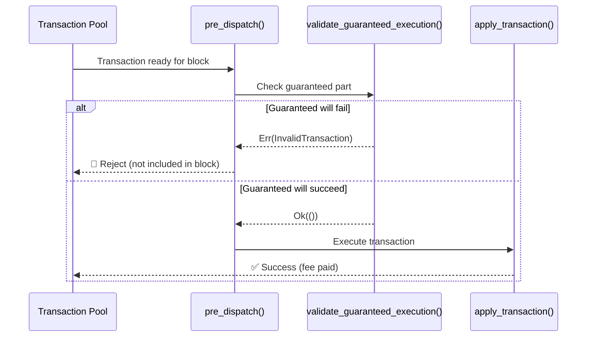

# ADR: Pre-Dispatch Validation of Guaranteed Transaction Part

## Status

Accepted

## Context

Midnight transactions have a two-phase execution model:
1. **Guaranteed part** - Always executes; fees are extracted here
2. **Fallible part** - May succeed or fail; failure is acceptable

A DDoS vulnerability exists where transactions can pass structural validation (`well_formed()`) but fail during guaranteed execution. When this happens:
- The transaction is included in the block (consumes blockspace)
- The guaranteed part fails before fees are extracted
- **Result:** Blockspace consumed, zero fees paid

An attacker can exploit this by flooding the network with structurally valid transactions designed to fail the guaranteed part, filling blocks without paying fees.

### Technical Forces

- Current validation (`well_formed()`) only checks structural validity, not semantic validity
- The `pre_dispatch` hook is underutilized (currently just re-runs `validate_unsigned`)
- Transactions pass pool validation but fail during block execution
- State-dependent conditions cannot be checked at pool entry time

### Business Forces

- DDoS attacks undermine network reliability and user trust
- Attackers can fill blocks at zero cost, denying service to legitimate users
- Network economics depend on fee extraction for resource consumption

### Operational Forces

- Block authors cannot filter transactions that will fail guaranteed execution
- Failed transactions waste computational resources during block building
- No mechanism exists to reject semantically invalid transactions before inclusion

### DDoS Attack Vector

                         VALIDATION                           EXECUTION
                        (Pool Entry)                      (Block Building)
                              │                                  │
    Transaction ─────────────►│ well_formed() ✓ ────────────────►│ apply()
                              │                                  │
                              │ Checks:                          │ Executes:
                              │ • Proof validity                 │ • State modifications
                              │ • Signature validity             │ • Contract calls
                              │ • Balancing                      │ • Fee extraction ◄── HERE
                              │ • Structure                      │
                              │                                  │
                              │ Does NOT check:                  │
                              │ • State conditions               │
                              │ • Contract existence             │
                              │ • Replay protection              │
                              │ • Balance sufficiency            │
                              │                                  │
                              ▼                                  ▼
                        Enters Pool                    Failure → No Fee Paid
                                                                 ↓
                                                      BUT: Blockspace Consumed!

### Guaranteed Part Failure Vectors

The following `TransactionInvalid` errors can occur during guaranteed part execution, causing fee-free blockspace consumption:

| Category | Error | Description |
|----------|-------|-------------|
| **Contract** | `ContractNotPresent` | Call to non-existent contract |
| | `ContractAlreadyDeployed` | Contract already deployed at address |
| | `VerifierKeyNotFound` | Missing verifier key for operation |
| | `VerifierKeyAlreadyPresent` | Verifier key already exists |
| **Replay** | `ReplayCounterMismatch` | Contract replay counter mismatch |
| | `ReplayProtectionViolation` | TTL expired, TTL too far in future, or intent already exists |
| **Balance** | `InsufficientClaimable` | Not enough claimable balance |
| | `BalanceCheckOutOfBounds` | Balance check failed (overflow/underflow) |
| | `RewardTooSmall` | Reward claim below minimum threshold |
| **Zswap** | `NullifierAlreadyPresent` | Double-spend attempt |
| | `CommitmentAlreadyPresent` | Faerie-gold attempt |
| | `UnknownMerkleRoot` | Invalid coin tree root |
| **Execution** | `Transcript` | Onchain runtime execution failure |
| | `EffectsMismatch` | Declared effects don't match computed |
| **UTXO** | `InputNotInUtxos` | Input not in UTXO set |
| **Dust** | `DustDoubleSpend` | Dust nullifier already spent |
| | `DustDeregistrationNotRegistered` | Deregistration for unregistered user |
| **Other** | `GenerationInfoAlreadyPresent` | Generation info already exists |
| | `InvariantViolation` | Ledger invariant violated |

All of these can be exploited to consume blockspace without paying fees if not caught before block inclusion.

**Ticket:** [PM-20944](https://shielded.atlassian.net/browse/PM-20944)

## Decision Drivers

1. **Zero-cost attack prevention** - Transactions that fail the guaranteed part consume blockspace without paying fees
2. **Correct validation timing** - State-dependent checks must use current block state, not stale pool state
3. **Minimal architecture impact** - Solution should work within existing Substrate patterns
4. **No economic model changes** - Avoid introducing new fee mechanisms or account abstractions

## Considered Options

### Option 1: Enhanced `pre_dispatch` validation (Selected)

Add semantic validation of guaranteed part before block inclusion using a new `validate_guaranteed_execution` function.

- ✅ Uses current block state (accurate validation)
- ✅ Catches failures at the correct pipeline point
- ✅ Minimal changes to ledger architecture
- ✅ Follows existing Substrate patterns
- ❌ Some work duplication (validate + apply)
- ❌ Small performance overhead

### Option 2: Substrate-level base fee

Charge a minimum fee via Substrate's fee mechanism before ledger execution.

- ✅ Simple implementation using existing Substrate infrastructure
- ❌ Changes economic model of the chain
- ❌ Still wastes blockspace (transaction included, then fails)
- ❌ Requires account abstraction for fee payment

### Option 3: Dry-run in pool validation

Simulate guaranteed execution during `validate_unsigned`.

- ✅ Catches failures earlier in pipeline
- ❌ Uses stale state (pool validation may happen long before block)
- ❌ Expensive to run for every pool entry

### Option 4: Move fee extraction first

Restructure ledger to extract fees before guaranteed execution.

- ✅ Fundamental fix to the root cause
- ❌ Major ledger architecture change
- ❌ High risk of breaking existing functionality
- ❌ High implementation effort

### Option 5: Block builder hints

Advisory system for block authors to filter problematic transactions.

- ✅ Low coupling with existing code
- ❌ Advisory only (doesn't prevent determined attackers)
- ❌ Requires changes to block authoring logic

## Decision

Implement **Option 1: Enhanced `pre_dispatch` validation** because it catches failures at the correct point (block building, not pool entry), uses current block state for validation, requires minimal changes to ledger architecture, and follows existing Substrate patterns.

Key constraints:
- Validation must be read-only (no state modifications)
- Validation must use the same logic as actual guaranteed execution
- Rejected transactions must not be included in blocks
- Edge case handling: state could change between `pre_dispatch` and `apply` (handled by existing error path)

## Confirmation

The decision will be validated through:

1. **Unit tests**: Verify transactions with failing guaranteed parts are rejected at `pre_dispatch`
2. **Attack simulation**: Batch of malicious transactions shows 0 blockspace consumed
3. **Regression tests**: Valid transactions still process correctly

**Success criteria:**
- 100% of failing-guaranteed transactions rejected before block inclusion
- Block building time impact < 10%
- No regressions in existing transaction processing

## Notes

- Performance overhead is acceptable given the security benefit
- Transactions with successful guaranteed but failed fallible parts still work correctly (partial success)
- The validation function must stay synchronized with actual execution logic to prevent divergence
