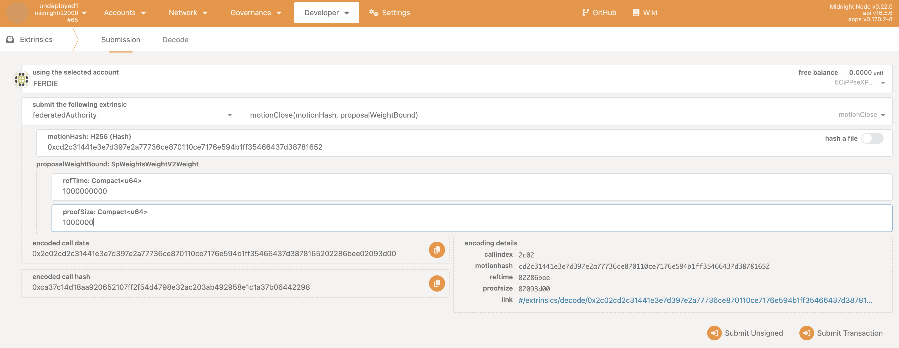

# Runtime Upgrade through Governance

This guide walks through the complete process of performing a runtime upgrade using the Federated Authority Governance System. The upgrade requires approval from both the **Council** and **Technical Committee** before execution.

## Prerequisites

- Access to Polkadot.js Apps connected to your Midnight node
- At least 2/3 Council member accounts
- At least 2/3 Technical Committee member accounts
- The new `midnight_node_runtime.compact.compressed.wasm` runtime WASM blob and its code hash
    - the file can be found under `./target/release/wbuild/midnight-node-runtime`

## Overview

The runtime upgrade process follows these steps:

1. **Get the Code Hash** - A new WASM blob runtime it is necessary
2. **Council approval** - Council proposes and votes on `federatedAuthority.motionApprove` with a nested `system.authorizeUpgrade` call.
3. **Technical Committee approval** - TC proposes and votes on the same motion
4. **Close the federated motion** - Execute `federatedAuthority.motionClose`
5. **Apply the upgrade** - Submit the WASM blob via `system.applyAuthorizedUpgrade`

---

> **Note**: The order of Council and Technical Committee proposals (Steps 2 and 3) is not relevant. They can be done in parallel.

## Step 1: Get the Code Hash

Before starting the governance process, you need the code hash of the new runtime WASM.

The code hash is a H256 hash of the compact compressed runtime WASM blob. You can obtain it by:
- Using the encoding details shown in Polkadot.js when uploading the WASM blob file
- Provided by an authority, for example the Midnight Foundation

---

## Step 2: Council Proposal

### 2.1 Navigate to Council Motions

Go to **Governance > Council > Motions**. Initially, you'll see no active motions.

### 2.2 Create the Proposal

Click **"Propose motion"** and fill in the following:

- **propose from account**: Select a Council member account
- **threshold**: Set to `2` (requires 2/3 approval for a 3-member council)
- **proposal**: Select `federatedAuthority` > `motionApprove(call)`
- **call**: Select `system` > `authorizeUpgrade(codeHash)`
- **codeHash**: Enter the H256 hash of the new runtime WASM or upload the file

Click **"Propose"** to submit the transaction.

### 2.3 View the Pending Motion

After the proposal is submitted, it appears in the motions list showing:
- Motion index (e.g., `0`)
- The call: `federatedAuthority.motionApprove`
- Threshold required
- Voting end time (5 days from creation)
- Current vote count

### 2.4 Vote on the Motion

Each Council member needs to vote. Click **"Vote"** on the motion to open the voting dialog.

Select:
- **vote with account**: Choose your Council member account
- Click **"Vote Aye"** to approve or **"Vote Nay"** to reject

Repeat this for each Council member until the 2/3 threshold is reached.

### 2.5 Motion Approved

Once enough "Aye" votes are collected, the motion shows as approved (e.g., "Aye 2/2").

The expanded motion view shows:
- **call**: `system.authorizeUpgrade`
- **codeHash**: The runtime hash
- **call hash**: Hash of the `system.authorizeUpgrade` call
- **proposal hash**: Hash identifying this proposal

### 2.6 Close the Council Motion

Once the threshold is reached, close the motion to trigger the `federatedAuthority.motionApprove` call.

Go to **Developer > Extrinsics** and submit:

- **extrinsic**: `council` > `close(proposalHash, index, proposalWeightBound, lengthBound)`
- **proposalHash**: The proposal hash from the motion view
- **index**: The motion index (e.g., `0`)
- **proposalWeightBound**: Weight estimate (e.g., `refTime: 1000000000`, `proofSize: 1000000`)
- **lengthBound**: Length bound (e.g., `1000000`)

### 2.7 Verify Council Events

After closing, check the events in **Network > Explorer**:

You should see:
1. `council.Closed` - The proposal was closed
2. `council.Approved` - The motion passed
3. `federatedAuthority.MotionApproved` - Council's approval registered with `authId: 40` (Council's pallet index)
4. `council.Executed` - The motion was executed successfully

### 2.8 Query Federated Authority Storage

Verify the motion is registered by querying **Developer > Chain State**:

- **selected state query**: `federatedAuthority` > `motions(H256)`
- Leave the hash field empty to query all motions

The result shows:
- **motion hash**: The unique identifier for this motion
- **approvals**: `[40]` - Only Council (pallet index 40) has approved so far
- **endsBlock**: Block number when the motion expires
- **call**: The `system.authorizeUpgrade` call details

---

## Step 3: Technical Committee Proposal

The Technical Committee must now propose and approve the **exact same motion** to reach the unanimous approval requirement.

### 3.1 Navigate to Technical Committee

Go to **Governance > Tech. comm. > Proposals**.

### 3.2 Submit the Proposal

Click **"Submit proposal"** and configure identically to the Council proposal:

- **propose from account**: Select a Technical Committee member account
- **threshold**: Set to `2` (requires 2/3 approval)
- **proposal**: Select `federatedAuthority` > `motionApprove(call)`
- **call**: Select `system` > `authorizeUpgrade(codeHash)`
- **codeHash**: Enter the **same** H256 hash used in the Council proposal

> **Important**: The `codeHash` must be identical to ensure both bodies approve the same motion hash.

### 3.3 Vote and Approve

Follow the same voting process as the Council:

1. Each TC member votes "Aye" on the proposal
2. Wait until the 2/3 threshold is reached

### 3.4 Close the Technical Committee Motion

Close the motion using:

- **extrinsic**: `technicalCommittee` > `close(proposalHash, index, proposalWeightBound, lengthBound)`

Use the same parameters as the Council close, but with the TC proposal hash.

### 3.5 Verify Both Approvals

Query the federated authority storage again:

Now the **approvals** array shows both bodies:
- `[40, 42]` - Council (40) and Technical Committee (42) have both approved

---

## Step 4: Close the Federated Motion

With both bodies having approved, anyone can now close the federated motion to execute the upgrade authorization.

### 4.1 Submit motionClose

Go to **Developer > Extrinsics** and submit:

- **extrinsic**: `federatedAuthority` > `motionClose(motionHash)`
- **motionHash**: The motion hash from the storage query

### 4.2 Verify Execution Events

Check the events after submission:

You should see:
1. `system.UpgradeAuthorized` - The upgrade was authorized with `checkVersion: Yes`
2. `federatedAuthority.MotionDispatched` - Motion executed with `motionResult: Ok`
3. `federatedAuthority.MotionRemoved` - Motion cleaned up from storage

---

## Step 5: Apply the Upgrade

The upgrade is now authorized. Anybody can now apply it by submitting the actual WASM blob.

### 5.1 Submit applyAuthorizedUpgrade

Go to **Developer > Extrinsics** and submit:

- **extrinsic**: `system` > `applyAuthorizedUpgrade(code)`
- **code**: Upload the compressed runtime WASM file

### 5.2 Verify Upgrade Success

Check the events for confirmation:

You should see:
- `system.CodeUpdated` - The runtime code was updated
- `system.ExtrinsicSuccess` - The extrinsic completed successfully

The runtime upgrade is now complete.

---

## Summary

| Step | Action | Extrinsic/Location |
|------|--------|-------------------|
| 1 | Prepare code hash | Compute Blake2-256 of WASM |
| 2a | Council proposes | `council.propose(federatedAuthority.motionApprove(...))` |
| 2b | Council votes | `council.vote(proposalHash, index, approve)` |
| 2c | Council closes | `council.close(proposalHash, index, ...)` |
| 3a | TC proposes | `technicalCommittee.propose(federatedAuthority.motionApprove(...))` |
| 3b | TC votes | `technicalCommittee.vote(proposalHash, index, approve)` |
| 3c | TC closes | `technicalCommittee.close(proposalHash, index, ...)` |
| 4 | Close federated motion | `federatedAuthority.motionClose(motionHash)` |
| 5 | Apply upgrade | `system.applyAuthorizedUpgrade(code)` |

## Useful Storage Queries

| Query | Purpose |
|-------|---------|
| `council.proposalCount()` | Number of Council proposals |
| `technicalCommittee.proposalCount()` | Number of TC proposals |
| `federatedAuthority.motions(hash)` | Motion details and approval status |
| `councilMembership.members()` | Current Council members |
| `technicalCommitteeMembership.members()` | Current TC members |

## Troubleshooting

### Motion hash mismatch
If the Council and TC approve different motion hashes, the federated motion won't reach the required approval threshold. Ensure both bodies use **identical** parameters when calling `federatedAuthority.motionApprove`.

### Motion expired
Motions have a 5-day time window. If the motion expires before both bodies approve, you'll need to start the process again with new proposals.

### Insufficient votes
Each collective requires a 2/3 majority. With 3 members, at least 2 must vote "Aye". Check that enough members have voted before attempting to close.
